<h1 align="center">AdventureWorks Lakehouse</h1>

<p align="center">
  A medallion lakehouse on Databricks, from a broken 72-file CSV export to a tested dbt star schema,<br>
  MLflow-tracked analyses and a five-page AI/BI dashboard. Deployed as one Asset Bundle.
</p>

<p align="center">
  <a href="https://github.com/JacobWillson13/adventureworks-lakehouse/actions/workflows/ci.yml"></a>
  
  
  
  
  
  
</p>

<p align="center">
  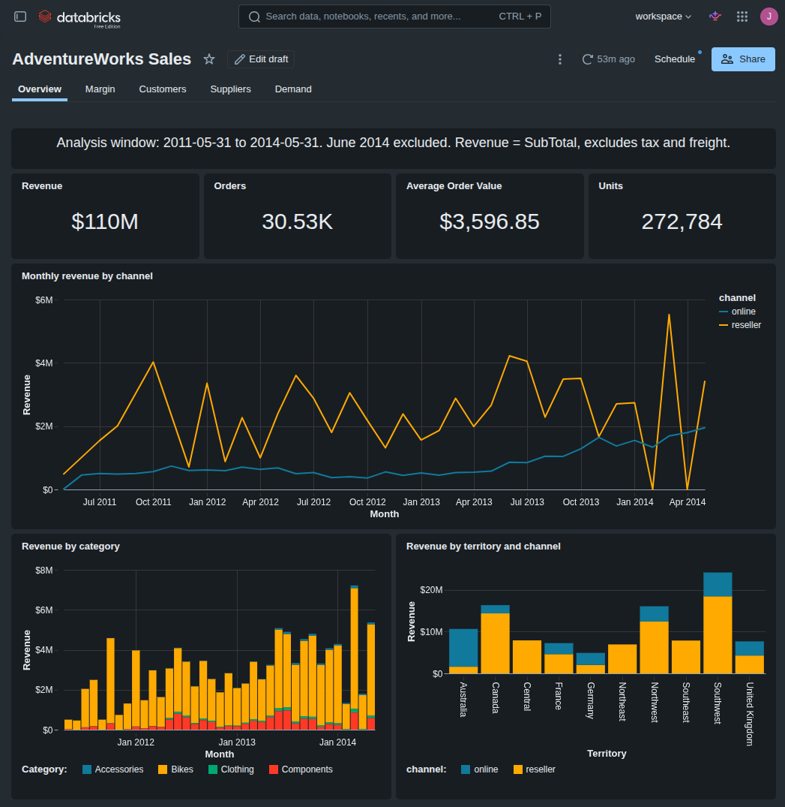
</p>

| 72 raw files | 71 bronze tables | 20 silver tables | 34 dbt models | 148 dbt tests | 5 analyses | 5 dashboard pages |
|:---:|:---:|:---:|:---:|:---:|:---:|:---:|
| no headers, 4 format defects | row counts verified | typed, with expectations | dims, facts, marts | incl. reconciliations | in MLflow | deployed as code |

**Contents:** [Findings](#what-the-data-says) · [Architecture](#architecture) · [How it is built](#how-it-is-built) · [Evidence](#evidence) · [Design decisions](#design-decisions) · [Run it](#run-it)

---

## What the data says

Window: 2011-05-31 to 2014-05-31 (June 2014 is a truncated extract). Revenue = SubTotal, excluding tax and freight.

**1. It is two businesses that never overlap.** 30,526 orders and $109.8M. Every online order comes from one of
18,484 individuals; every reseller order from one of 635 stores. Resellers bring about three quarters of revenue
with 12% of the orders, in monthly batches, and some months have no batch at all.

**2. July 2013 changed the online business.** Accessories and clothing launched online. Monthly online orders jump
from about 330 to over 1,500, and new customers from about 250 to over 1,100 a month. Any trend that crosses this
line without accounting for it is wrong on one side.

<table>
  <tr>
    <td width="50%">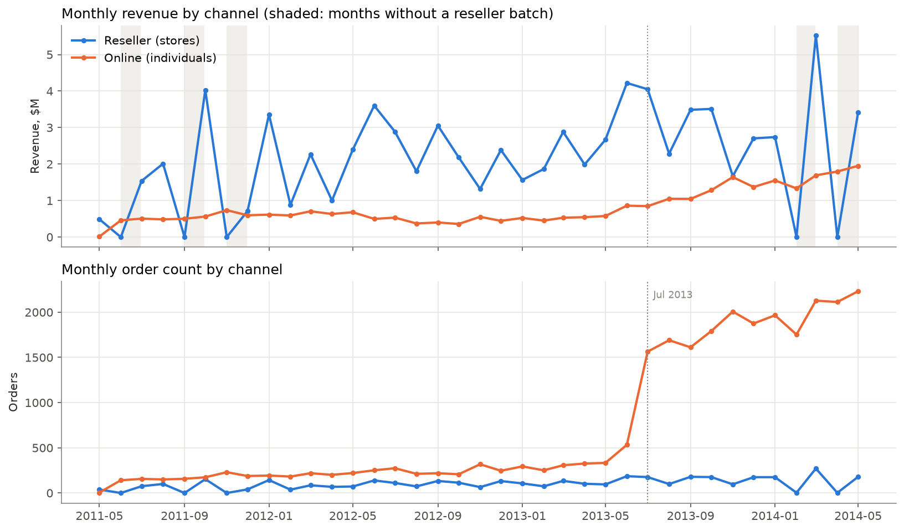</td>
    <td width="50%">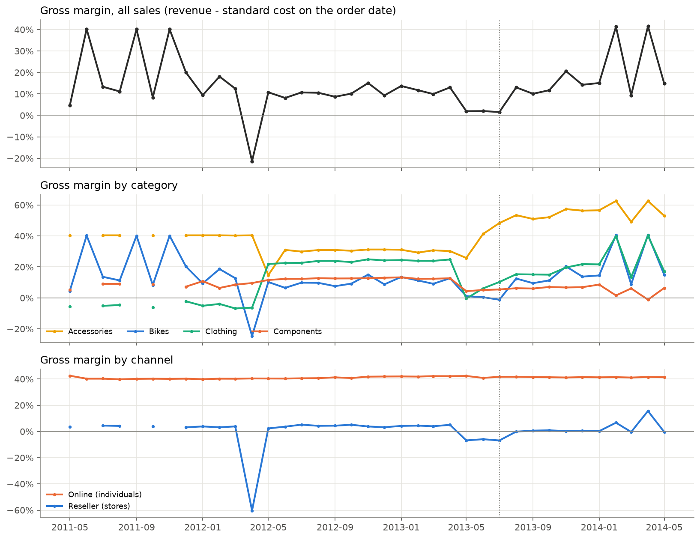</td>
  </tr>
  <tr>
    <td><sub>Revenue and orders by channel. Shaded months had no reseller batch; the dotted line is July 2013.</sub></td>
    <td><sub>Gross margin from cost history joined by effective date: total, by category, by channel.</sub></td>
  </tr>
</table>

**3. Online makes the money; resellers move the volume.** Online sells at a steady 40% gross margin. Reseller margin
is 0.6% overall: resellers lose money on bikes, components are their only clearly profitable category, and
April 2012 (a Mountain-100 clearance) drops to -60%. Overall margin is 11.4%.

**4. Customers split into three segments.** K-means on RFM-style features (k = 3, individuals only): bike + gear
buyers are about 43% of customers and 84% of online revenue; accessory and clothing buyers are about half of
customers and 2% of revenue; bike-only buyers are the rest.

**5. Forecasting does not beat naive, and that is the result.** Monthly units per product, rolling-origin backtest:
the best model (ETS) reaches 49.0% WAPE against 49.4% for naive. Splitting by channel makes it worse (53.8%).
With batch-driven reseller demand, this grain is mostly noise. Reporting the baseline honestly beats a fake win.

**6. Supplier quality is a refusal problem, not an inspection problem.** Across all purchase orders (2011-04 to
2014-09), 3.1% of received units are rejected; the worst vendors with real volume reach about 5.5%, mostly whole
deliveries refused rather than partial rejections. Lead time cannot be measured: there is no receipt date.

<table>
  <tr>
    <td width="50%">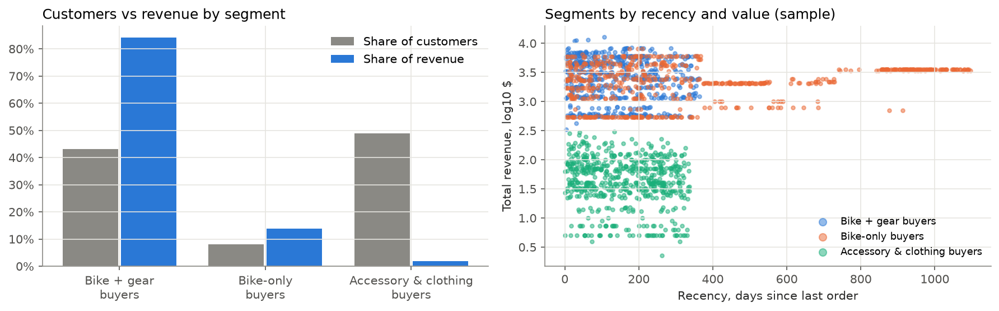</td>
    <td width="50%">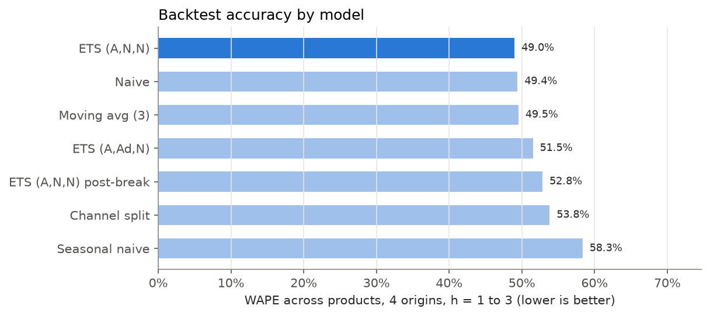</td>
  </tr>
  <tr>
    <td><sub>Segments: share of customers vs share of revenue, and recency vs value.</sub></td>
    <td><sub>Backtest WAPE by model across products and origins. Naive is the bar to beat.</sub></td>
  </tr>
</table>

All figures: [`reports/figures`](reports/figures).

---

## Architecture

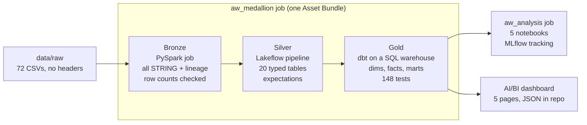

Everything is deployed by one Databricks Asset Bundle: two jobs, one pipeline, one dashboard, one MLflow
experiment. Transformation and analysis logic lives in `src/awlake` as plain functions, so it is unit-tested on local
Spark in CI; notebooks and pipeline files stay thin.

---

## How it is built

### 1. Bronze: make a broken export loadable

The export has no header row, one file in cp1252, records broken by unquoted line breaks and a malformed extra
file. Column names and types come from Microsoft's own DDL; per-file repairs live in config, not code. Every load
is checked against expected row counts and written to an audit table, so a silent truncation fails the job.

<p align="center">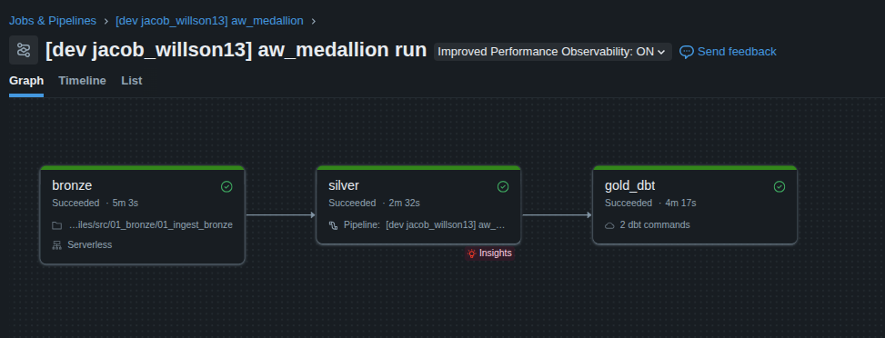</p>
<p align="center"><sub>The whole pipeline in one job run: bronze (5 min), silver (2.5 min), dbt gold (4 min).</sub></p>

<details>
<summary>Raw data defects and how each is handled</summary>

| File | Problem | Handling |
|---|---|---|
| all | No header row | Columns from Microsoft's `instawdb.sql`, incl. computed columns |
| Address | cp1252, not UTF-8 | Strict cp1252 decode in Python (Spark 4 CSV rejects that charset) |
| ProductReview | Unquoted CRLF line breaks inside `Comments` (34 lines, 4 records) | Rows rebuilt on record-start pattern |
| AWBuildVersion | Column name with a space (`Database Version`) | Sanitized to `Database_Version` |
| ErrorLog | 0-byte file | Empty table with full schema |
| JobCandidate_TOREMOVE | Not in DDL, malformed row | Excluded (documented) |
| ProductModelorg | Not in DDL | Loaded with ProductModel's schema as `product_model_org` |

</details>

### 2. Silver: types, conformance and data quality

A Lakeflow Declarative Pipeline turns 20 bronze tables into typed, snake_case materialized views. Expectations on
keys, foreign keys and NOT NULL columns are the data quality record: each table shows its expectations and output
counts in the pipeline graph.

<p align="center">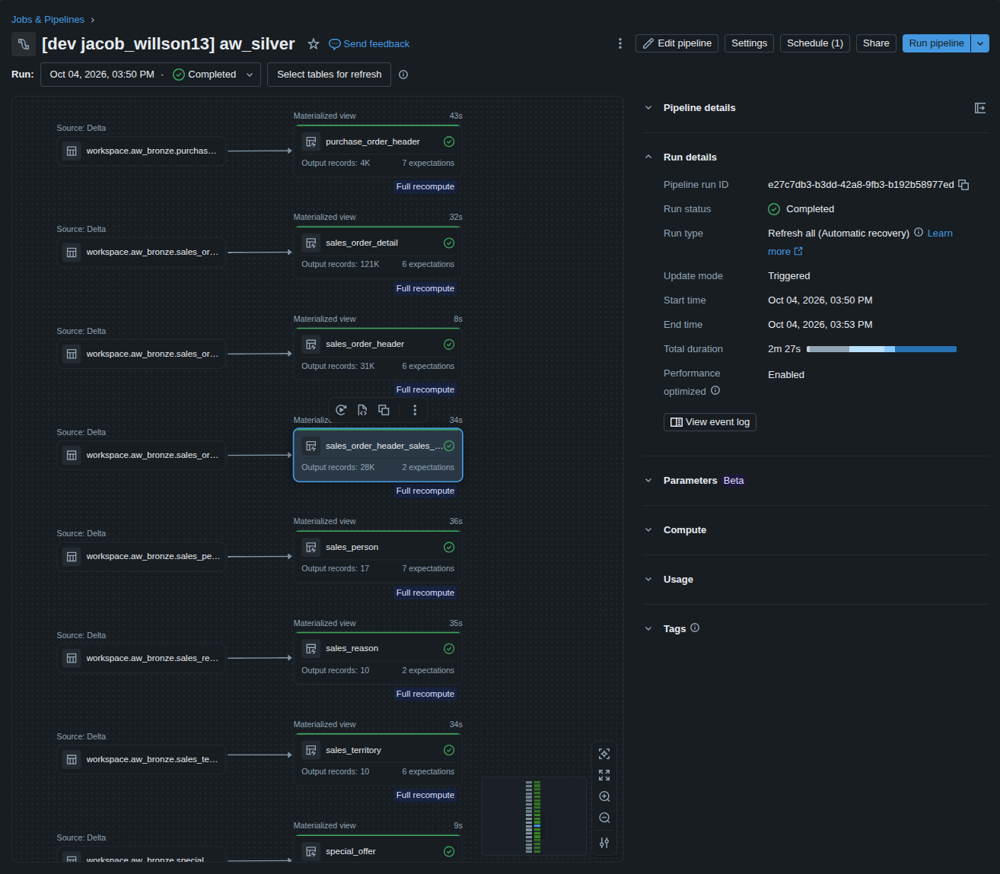</p>

### 3. Gold: a tested star schema in dbt

dbt builds staging views, four dimensions, four facts and six analysis marts, then 148 tests. The tests that matter
most are business rules, not just keys: order revenue reconciles to its lines within a cent, every online order
belongs to an individual and every reseller order to a store, and marts reconcile back to the facts.

<p align="center">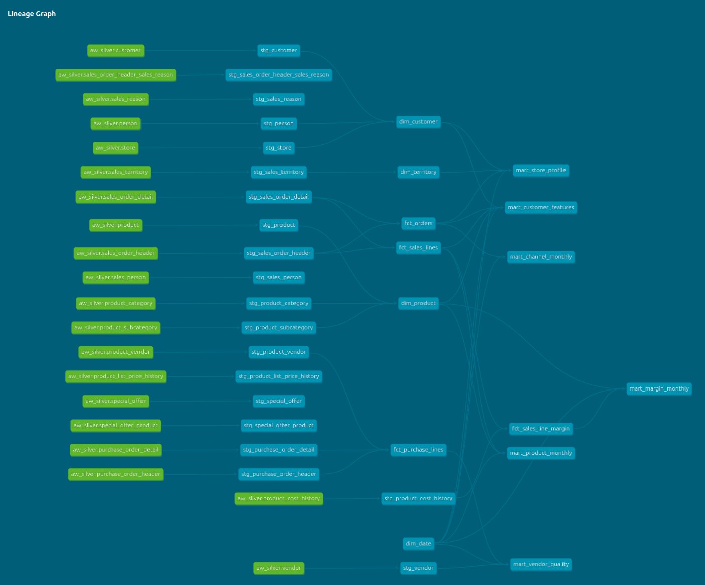</p>

The hardest model is margin. Product cost changes over time, so each order line is joined to the cost period that
was in effect on its order date. A test guarantees no line matches two periods; 64 lines of discontinued products
match none and carry their last known cost forward, reported as a warning that fails if the count grows.

<p align="center">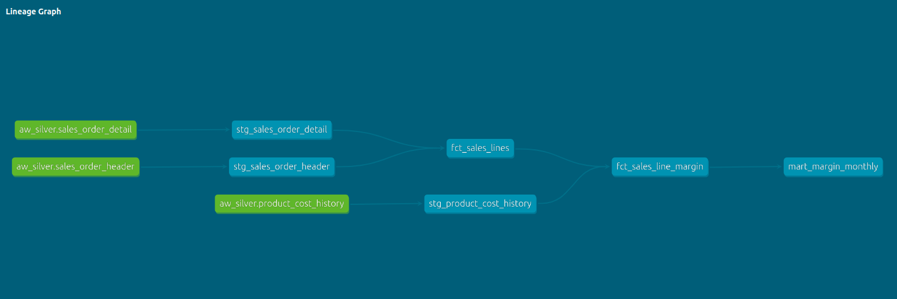</p>

### 4. Analysis: tracked in MLflow

Five notebooks run as one job on serverless compute: sales exploration, customer segmentation, forecasting, margin
and supplier quality. Segmentation and forecasting log parameters, metrics, figures and the fitted model to an
MLflow experiment defined in the bundle.

<p align="center">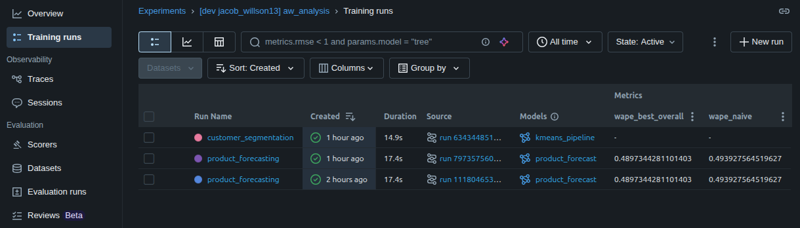</p>

### 5. Dashboard: AI/BI, versioned as code

The dashboard was laid out in the Databricks UI, exported to JSON and deployed by the bundle, so the repo is the
source of truth. Every dataset reads gold through the same analysis window.

<table>
  <tr>
    <td width="50%">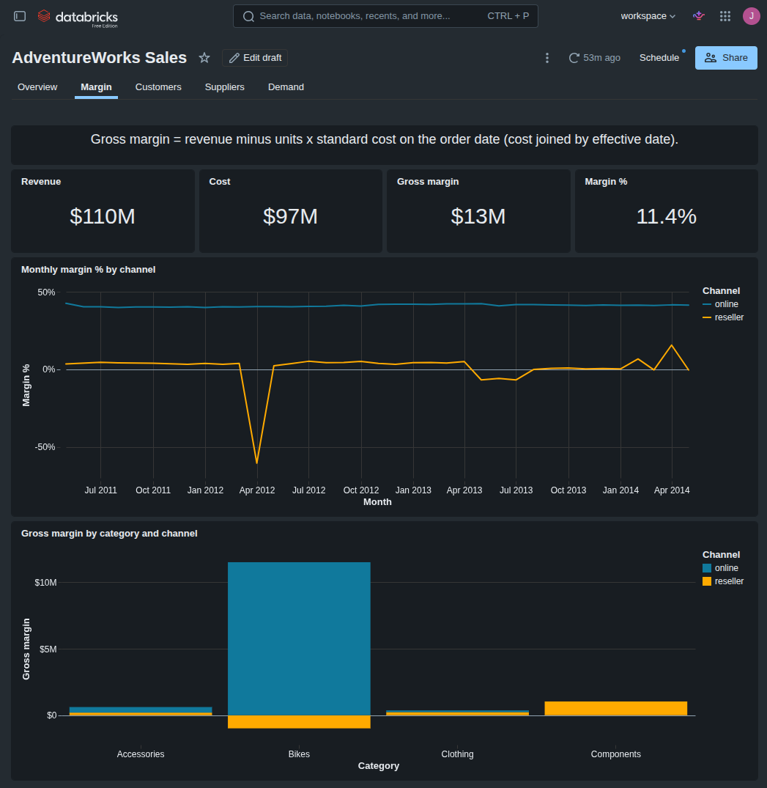</td>
    <td width="50%">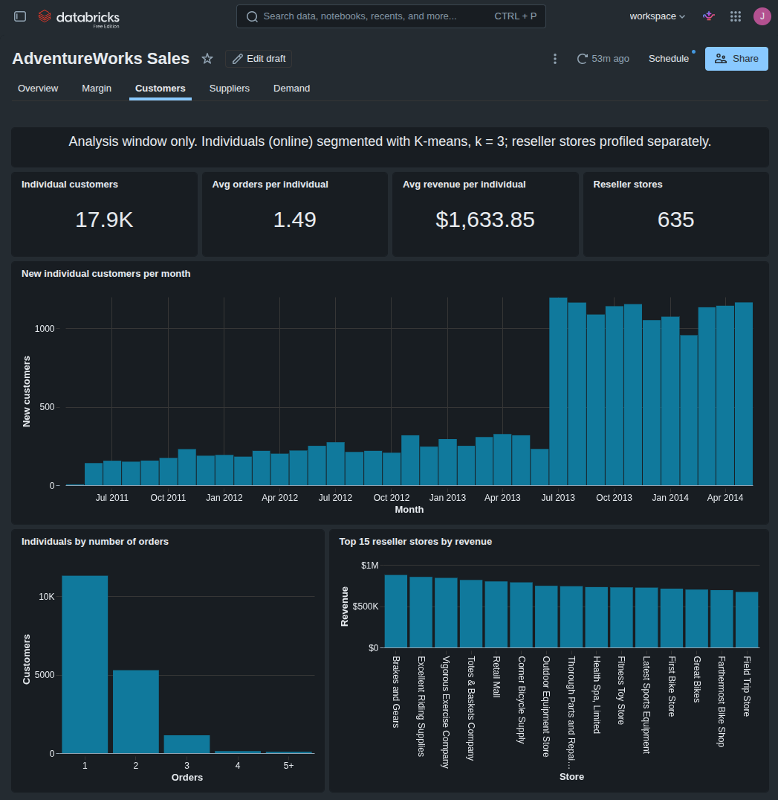</td>
  </tr>
  <tr>
    <td><sub><b>Margin.</b> Online steady near 40%; reseller near zero, negative on bikes.</sub></td>
    <td><sub><b>Customers.</b> New-customer step in July 2013; most individuals order once or twice.</sub></td>
  </tr>
  <tr>
    <td width="50%">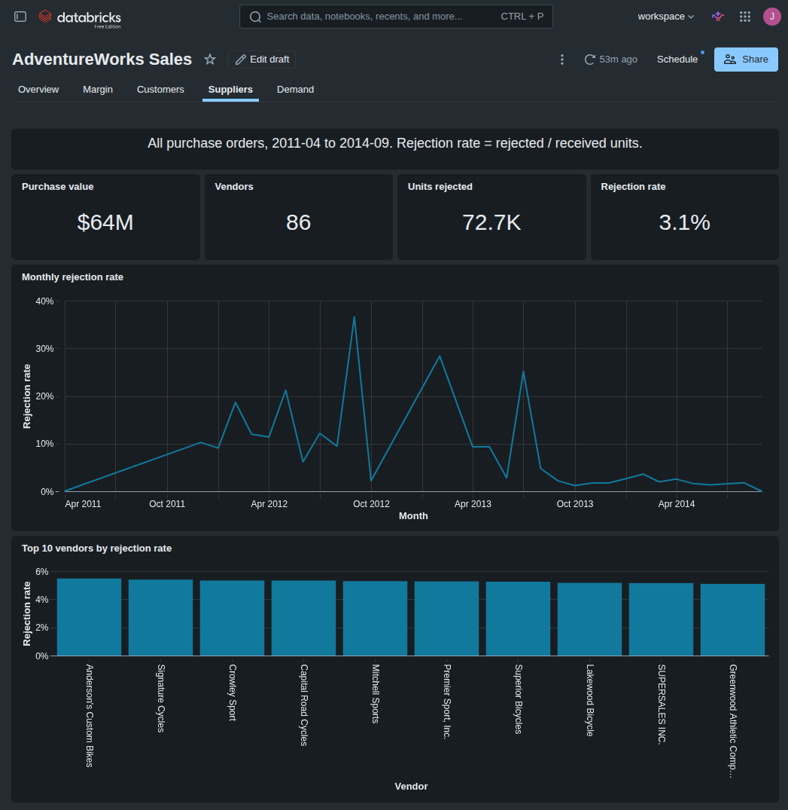</td>
    <td width="50%">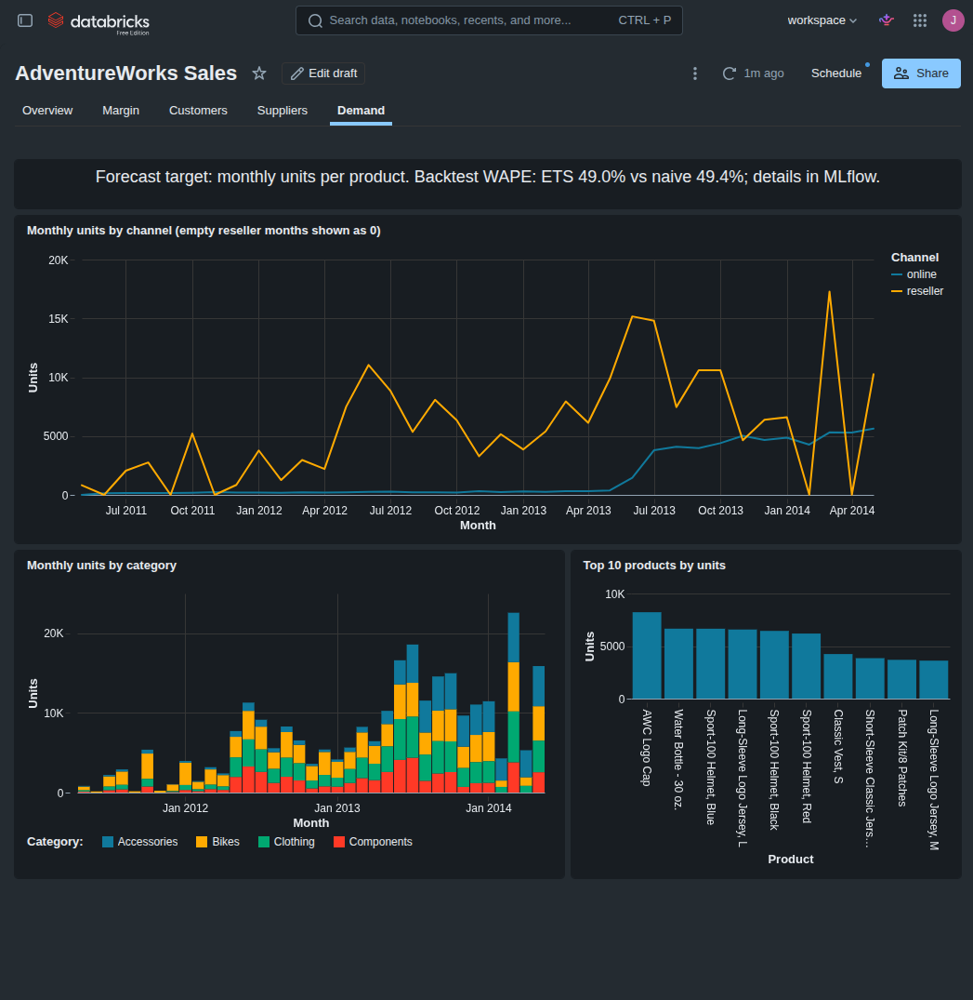</td>
  </tr>
  <tr>
    <td><sub><b>Suppliers.</b> Rejection rate settles after 2013; worst vendors near 5.5%.</sub></td>
    <td><sub><b>Demand.</b> Batch-driven reseller units vs a smooth online line.</sub></td>
  </tr>
</table>

---

## Evidence

| Layer | What is checked | Result |
|---|---|---|
| Bronze | Row count per table vs expected; audit table | 71 tables exact, 1 malformed file excluded and documented |
| Silver | Expectations on keys, foreign keys, NOT NULL columns | All passing on 20 tables |
| Gold | 148 dbt tests incl. revenue reconciliation, channel rule, effective-date uniqueness | All passing; 1 tracked warning (64 carried-forward cost lines) |
| Analysis | Rolling-origin backtest; segmentation stability | Reported as is, including a forecast that does not beat naive |
| Code | ruff, pytest (unit + local Spark), `dbt parse` in CI | Green on every push and pull request |

---

## Design decisions

- **Revenue = SubTotal.** Tax and freight are reconciled alongside in `fct_orders`, never mixed into revenue.
- **One analysis window, defined once.** `dim_date.is_in_analysis_window` drops the truncated June 2014; facts keep
  every row and every analysis filters through the same flag. Purchasing data is not truncated, so supplier quality
  uses all of it.
- **Channels are analysed separately.** Individuals and stores are different populations; mixing them hides both.
- **Bronze is a job, not part of the pipeline.** The raw repairs (record rebuilds, cp1252) are beyond what Auto Loader
  expresses; Lakeflow takes over from typed bronze tables.
- **Logic in a package, not in notebooks.** `src/awlake` is testable with local Spark, so CI can check it without a
  workspace or the data.

## What I would do next

- Incremental loads (Auto Loader into bronze, streaming tables in silver) instead of full recomputes.
- A `prod` bundle target with a service principal, scheduled runs and failure alerts.
- Dashboard refresh on a schedule after the medallion job, and dbt source freshness checks.

---

## Repository layout

```
config/        schema (from Microsoft DDL), ingestion overrides, expected row counts
scripts/       schema builder, raw profiler, local bronze dry run, volume upload
src/awlake/    shared Python used by notebooks and tests
src/00_setup/  schemas + landing volume
src/01_bronze/ raw files -> Delta, all STRING, with lineage columns
src/02_silver/ typed and conformed tables (Lakeflow Declarative Pipeline): sales.py, purchasing.py
src/awlake/analysis/  analysis logic (sales, segmentation, forecasting, margin, supplier), plots, MLflow
dashboards/    AI/BI dashboard definition (exported JSON, deployed by the bundle)
docs/          build plan and design decisions (PLAN.md), fct_orders spec, README images
dbt/           gold: staging views, star schema (dims + facts), analysis marts and tests
notebooks/     00 local prototype (record); 10 to 14 analyses on gold, run by the aw_analysis job
reports/figures/  figures from the analysis notebooks
reports/prototype/  figures and tables from the local prototype that validated the design
resources/     Databricks job definitions (Asset Bundle)
tests/         pytest, incl. local Spark tests of each raw-format quirk
.github/       CI: ruff, pytest, dbt parse
```

## Run it

Data: Microsoft AdventureWorks sample database, 72 tab-delimited CSVs in `data/raw/` (gitignored, never committed).
Prerequisites: Python 3.12+, Java 17+ (for local Spark), Databricks CLI, a Databricks workspace (Free Edition works).

```bash
python3 -m venv .venv && source .venv/bin/activate
pip install -r requirements.txt
ruff check .                               # lint
python -m pytest -q                        # unit + local Spark tests
python scripts/profile_raw.py              # structural check of every raw file
python scripts/bronze_dryrun.py            # full bronze read locally, row counts checked
python scripts/silver_dryrun.py            # silver pipeline code locally, expectation violations counted

databricks auth login --host https://<workspace>.cloud.databricks.com --profile DEFAULT
export BUNDLE_VAR_warehouse_id=<warehouse id>   # SQL warehouse for the gold_dbt task (see below)
databricks bundle validate
databricks bundle deploy
databricks bundle run aw_setup             # once: schemas + landing volume
scripts/upload_raw.sh                      # data/raw -> /Volumes/workspace/aw_raw/landing
databricks bundle run aw_medallion         # bronze -> silver -> gold_dbt
databricks bundle run aw_analysis          # notebooks 10 to 14 on gold; MLflow experiment aw_analysis
databricks bundle summary                  # dashboard and job URLs
```

The `gold_dbt` task runs on a SQL warehouse whose ID is the bundle variable `warehouse_id` (no default). Set it
with `export BUNDLE_VAR_warehouse_id=<id>` as above, or pass `--var warehouse_id=<id>` to each `bundle` command.
To find it: **SQL Warehouses** in the sidebar, open the warehouse, **Connection details** tab. The HTTP path
looks like `/sql/1.0/warehouses/<id>`; its last segment is the ID.

<details>
<summary>Run everything locally, without a workspace</summary>

Silver, gold and the analyses also run on local Spark, with a persistent catalog in `.lakehouse/` (gitignored).
Needs `pip install "dbt-spark[session]"` (in `requirements.txt`). Run from the repo root, one command at a time:

```bash
python scripts/silver_dryrun.py --write                   # expectations report + local aw_silver tables
cd dbt && dbt build --target local --profiles-dir . && cd ..   # gold on local Spark
python notebooks/10_sales_exploration.py                  # each analysis notebook runs as a script
python notebooks/11_customer_segmentation.py              # MLflow runs go to .lakehouse/mlflow.db
python notebooks/12_forecasting.py
python notebooks/13_margin.py
python notebooks/14_supplier_quality.py
mlflow ui --backend-store-uri sqlite:///.lakehouse/mlflow.db   # browse the runs
```

</details>

<details>
<summary>Run dbt from your machine against the SQL warehouse</summary>

Runs the gold models and tests from your machine against the same SQL warehouse. `dbt/profiles.yml` reads the
connection from environment variables, so no credentials are stored in the repo:

| Variable | Value |
|---|---|
| `DBT_HOST` | Server hostname from **Connection details**, without `https://` |
| `DBT_HTTP_PATH` | HTTP path from **Connection details** |
| `DBT_ACCESS_TOKEN` | Personal access token (**Settings > Developer > Access tokens**) |
| `DBT_CATALOG`, `DBT_SCHEMA` | Optional; default `workspace` and `aw_gold` |

```bash
export DBT_HOST=<server hostname>
export DBT_HTTP_PATH=<http path>
read -s DBT_ACCESS_TOKEN && export DBT_ACCESS_TOKEN   # paste the token; not echoed or saved in history
cd dbt && dbt build                        # staging views, dims, facts and all tests into workspace.aw_gold
dbt docs generate && dbt docs serve        # browse model docs and lineage
```

</details>
